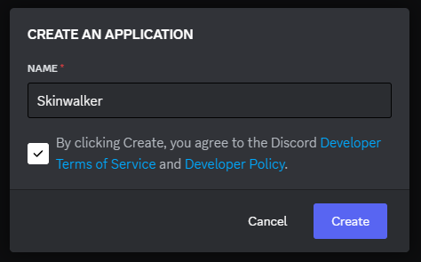
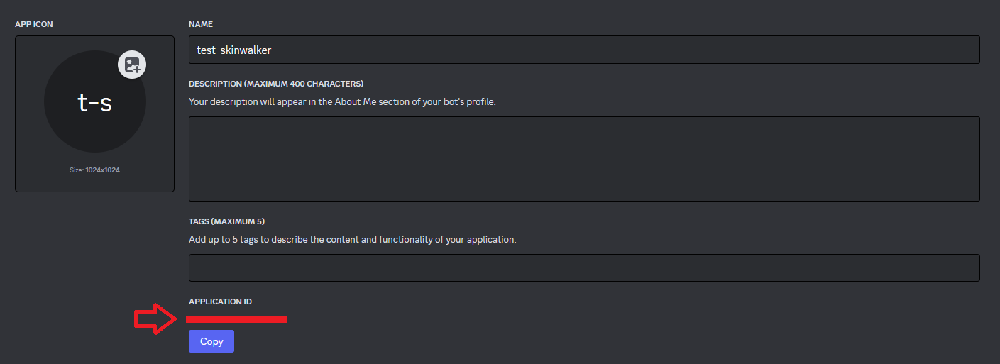

| :warning:        | This bot is currently in a testing phase and may contain bugs or unexpected behaviors. If you encounter any problems, bugs, or have suggestions for improvement, please report them by creating a new issue on our GitHub page: [Report Bugs Here](https://github.com/ibrahim-kabir/discord-skinwalker-bot/issues).|
|---------------|:------------------------|

# Voice Detection and Imitation Discord Bot

This Discord bot, called Skinwalker Bot, is designed to add a touch of humor to
voice channels by recording user conversations and randomly repeating amusing or
interesting phrases in the selected voice channel.

## Functionality Overview

- **Voice Recording**: The bot constantly records audio of users in the voice
  channel the bot is in.
- **Phrase Repetition**: It selects sentences less than 10 seconds said by a
  random user and repeat it in the active voice channel at random intervals.

## Prerequisites

Before setting up this bot, please ensure you have the following:

- **Hosting Service**: Since this bot is a self-project and not hosted globally,
  you'll need a hosting service such as a server. Make sure your hosting service
  has Docker installed.

## Setup

Follow these steps to set up the bot:

1. **Create a Bot on Discord Developer Portal**: Visit the [Discord Developer
   Portal](https://discord.com/developers/applications) and create a new bot.
   Give it a name according to your preference.

   

1. **Create a `.env` File**: Begin by creating a `.env` file and copying the
   content from the `.env.template` file.

1. **Modify the `.env` File:** Open the `.env` file in a text editor and locate
   the variable `SKINWALKER_TOKEN`. Replace its value with the token of the bot
   you just created on the [Discord Developer
   Portal](https://discord.com/developers/applications). 

1. **Replace `YOUR_BOT_ID` in the URL**: Locate your bot's application ID in the
   general tab of your bot settings on the [Discord Developer
   Portal](https://discord.com/developers/applications). Replace `YOUR_BOT_ID`
   with this application ID in the following URL:
   `https://discord.com/oauth2/authorize?client_id=YOUR_BOT_ID&permissions=2184183808&scope=bot`

   

1. **Invite the Bot to Your Servers**: Open the modified URL in a web browser to
   invite the bot to your servers.

## Usage

1. **Run the Docker container:** To run your Docker container, you can use the
   docker-compose up command:
   ```
   docker-compose up
   ```
